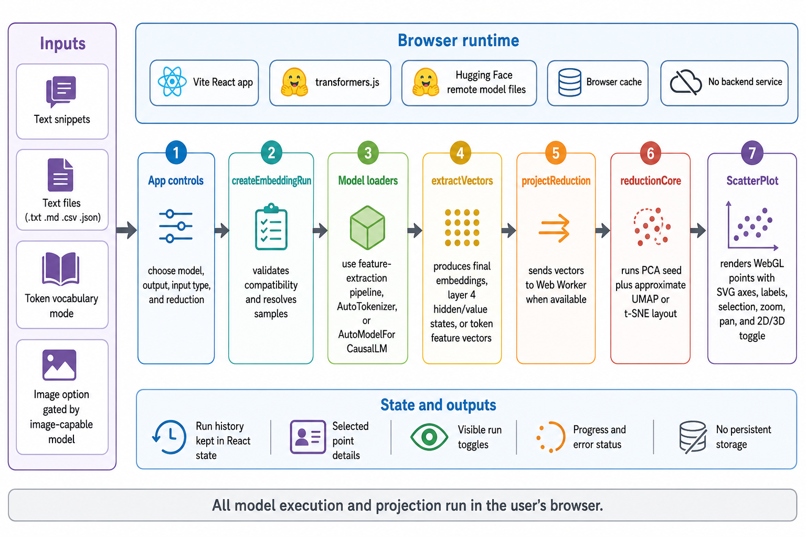

<div align="center">
  

  **Explore embedding spaces in your browser.**
</div>

EmbeddingViz is a browser-based React app for exploring how embedding models place text, files, tokens, and model outputs in vector space. It runs local UI state, model execution, dimensionality reduction, and plotting in the user's browser.

Use it to compare small embedding runs, inspect selected points, switch between PCA, UMAP, and t-SNE-style projections, and render dense point clouds with WebGL.

## Install

```bash
git clone https://github.com/tsilva/embeddingviz.git
cd embeddingviz
npm install
npm run dev
```

Open [http://127.0.0.1:5173](http://127.0.0.1:5173), or the URL printed by Vite if that port is already in use.

## Commands

```bash
npm run dev      # start the Vite dev server on 127.0.0.1
npm run build    # type-check and build the production bundle
npm run preview  # preview the production build locally
```

## Notes

- Models are loaded in the browser through `@huggingface/transformers`; remote Hugging Face model files are allowed and browser cache is enabled.
- There is no backend service or persistent app storage. Run history, selected points, and visibility toggles live in React state.
- Model embedding extraction and projection use Web Workers when available, with a main-thread fallback for non-image extraction.
- Token mode can project up to 50,000 tokenizer vocabulary entries.
- The CLIP preset uses the CLIP text encoder for the standard snippet workflow.

## Architecture



## License

No license file is currently included.
